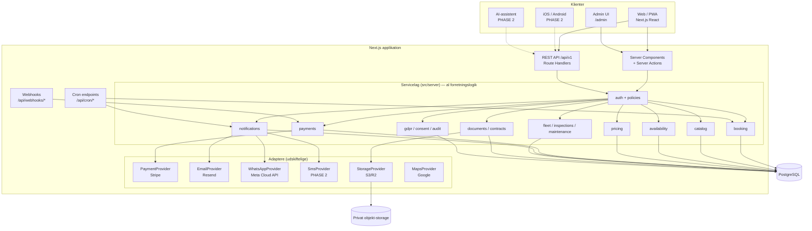
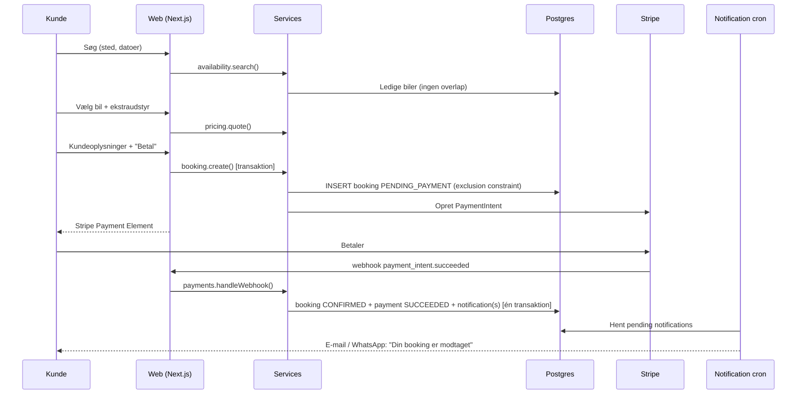

# A — Systemarkitektur

## Overordnet valg: modulær monolit

Vi bygger **én deploybar Next.js-applikation** med et strengt opdelt servicelag — ikke microservices.

Begrundelse:
- Et lille team (og en AI-udvikler) leverer hurtigst og mest robust med én kodebase, én database og én deploy.
- Bookingmotoren kræver transaktioner på tværs af booking, betaling og bil. Det er enkelt i én database og svært på tværs af services.
- Modulerne (`booking`, `pricing`, `payments`, `notifications` …) har klare grænser, så de kan flyttes ud senere, hvis det bliver nødvendigt.

## Lagdeling



### Regler for lagene

1. **UI kalder aldrig databasen direkte.** Server Components, Server Actions og Route Handlers kalder kun services.
2. **Services er rene TypeScript-funktioner** uden kendskab til HTTP eller React. De tager et `ctx` (aktuel bruger, rolle, locale, request-id) og validerede input.
3. **Al input valideres med Zod på serveren**, også selvom formularen allerede har valideret i browseren.
4. **Autorisation sker i servicelaget** via policies (`can(ctx, 'booking:update', booking)`), ikke kun i middleware.
5. **Tredjeparter ligger bag interfaces** (`PaymentProvider`, `MessageChannel`, `StorageProvider`). Udskiftning af fx WhatsApp-leverandør er én ny adapter-fil.
6. **REST API og UI deler services.** Mobilapp og AI-assistent får derfor automatisk samme prisberegning, tilgængelighed og regler.

## Kritiske designbeslutninger

### 1. Dobbeltbooking forhindres i databasen
Applikationstjek alene er ikke nok ved samtidige requests. Hver booking har et tidsinterval (`blocked_range`, inkl. klargøringsbuffer), og Postgres håndhæver:

```sql
EXCLUDE USING gist (car_id WITH =, blocked_range WITH &&)
  WHERE (status IN ('PENDING_PAYMENT','CONFIRMED','ACTIVE'))
```

To kunder, der klikker samtidig: den ene får sin booking, den anden får en pæn fejl ("Bilen blev netop booket — her er tilsvarende biler"). Se [03 — Database](03-database-erd.md).

### 2. Booking oprettes før betaling som en tidsbegrænset reservation
`POST /bookings` opretter booking med status `PENDING_PAYMENT` og `expires_at = now() + 15 min`. Bilen er låst i den periode. Stripe-webhook flytter den til `CONFIRMED`. Et cron-job annullerer udløbne reservationer.

Dette løser edge casen **"betaling gennemføres, men booking fejler"**: bookingen eksisterer altid *før* pengene trækkes. Hvis en betaling alligevel lander på en udløbet reservation, forsøger systemet at genaktivere den; er bilen taget, refunderes automatisk og admin får en alarm.

### 3. Prisen beregnes kun på serveren og gemmes som snapshot
`pricing.quote()` er én ren funktion, der bruges af både katalog, bilside, checkout og API. Ved booking gemmes hver linje (leje, ekstraudstyr, gebyrer, rabat) som `BookingItem` med beløb på det tidspunkt. Senere prisændringer påvirker ikke eksisterende bookinger.

### 4. Penge gemmes som heltal i mindste enhed
`amount_minor INT` + `currency CHAR(3)`. 399,00 kr. = `39900`. Ingen floats. Omregning sker kun server-side med en gemt kurs (se [13 — Konflikter](13-konflikter.md#k10-valuta)).

### 5. Notifikationer via transactional outbox
Når en booking bekræftes, skrives en `Notification`-række i **samme transaktion**. Et cron-job sender pending notifikationer med retry og backoff. E-mail- eller WhatsApp-fejl kan derfor aldrig rulle en booking tilbage, og intet bliver sendt for en booking, der ikke blev gemt.

### 6. Booking-status og betalingsstatus er adskilt
Se [13 — Konflikter, K1](13-konflikter.md#k1-bookingstatus-blander-booking-og-betaling).

### 7. Idempotens
- Stripe-webhooks gemmes med event-id; samme event behandles kun én gang.
- `POST /bookings` og `POST /payments` accepterer `Idempotency-Key`-header, så dobbeltklik og netværksgentagelser ikke giver dubletter.

### 8. Audit og logging
- `AuditLog` i databasen for forretningshændelser (hvem ændrede pris, status, refunderede …).
- Struktureret JSON-logging (pino) til drift, med automatisk redaktion af felter som `password`, `token`, `licenseNumber`, `email`.

## Dataflow: en booking fra start til slut



## Forberedt til fremtiden (bygges ikke nu)

| Fremtidig udvidelse | Hvad vi gør nu for at forberede |
|---|---|
| iOS/Android-app | Versioneret REST API `/api/v1`, token-baseret auth understøttet af auth-biblioteket |
| AI-assistent | `catalog.search()` tager struktureret input (passagerer, type, datoer), som en LLM kan udfylde via tool-calling. AI må kun lave *quotes og forslag*; booking kræver kundens eksplicitte bekræftelse i UI |
| Flere lokationer | `Location` er en førsteklasses entitet fra dag 1 |
| Flere valutaer | Alle beløb har `currency`; `ExchangeRate`-tabel |
| Flere sprog | `next-intl` med locale i URL; ingen hardcodet tekst |
| Flere flåder / multi-company | Alle hovedtabeller kan få `company_id` senere; vi undgår globale singletons i kode |
| Dynamic pricing | `PricingRule` har prioritet og gyldighedsperiode; nye regeltyper kan tilføjes |
| Telematik/GPS | `Car` har stabilt id; telemetri bliver en separat tabel/tjeneste |
