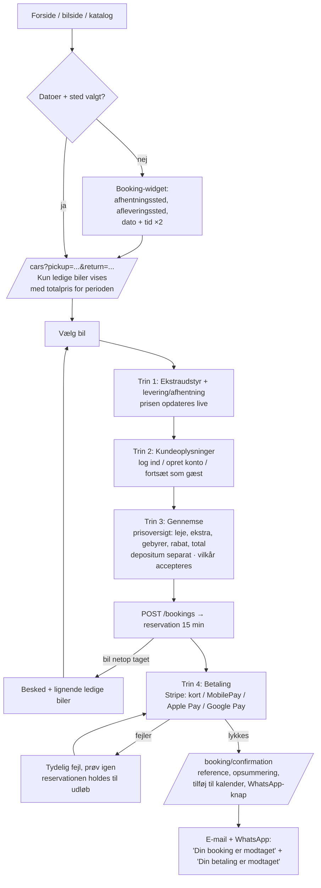

# E — User flows (kunde)

Princip (§45): *Kunden skal kunne leje en bil uden at skulle tænke.* Hvert trin viser altid: hvad er valgt, hvad koster det, hvad er inkluderet/ikke inkluderet, hvad er næste trin. En fast **prisoversigt** (sticky bund-bar på mobil, sidebar på desktop) følger kunden gennem hele flowet.

## E1. Hovedflow: søg → book → betal



Noter:
- Datoer/sted bæres i URL'en (delbart link, tilbage-knap virker).
- Gæsten skal **ikke** oprette konto. Efter betaling tilbydes "Gem dine oplysninger — opret konto med ét klik" (password sættes via e-mail-link).
- Mobil: hvert trin er én skærm med én primær knap i bunden. Ingen trin har mere end ~5 felter synlige ad gangen.
- Kundeoplysninger i MVP: navn, e-mail, telefon, fødselsdato (aldersgrænse), kørekortnummer + udløb. Adresse kun ved levering eller hvis virksomheden kræver det (se [14 — Manglende info](14-manglende-info.md)).
- Rabatkode-felt i trin 1 sammen med ekstraudstyr, så prisen opdateres, før kunden skriver sine oplysninger.
- **Implementeret (M7):** "Gennemse" er slået sammen med trin 2: prisoversigten står ved siden af formularen (sammenfoldet øverst på mobil), og vilkår accepteres i samme trin. Flowet er dermed: 1 Ekstraudstyr → 2 Dine oplysninger → 3 Betaling. Kørekort og fødselsdato indsamles ved afhentning indtil M11/M15.
- Uden Stripe-nøgler (lokalt og i CI, `FAKE_PAYMENTS=true`) viser betalingstrinnet en simuleret betaling, der går gennem samme webhook-behandling som Stripe.

## E2. Fra bil-side

```
/cars/[slug] → vælg datoer/sted i tilgængeligheds-widget
            → "Tjek tilgængelighed": ledig ✓ med pris / ikke ledig ✗ + næste ledige datoer + alternativer
            → "Book denne bil" → /booking?step=extras (samme flow som E1)
```

## E3. Før og under lejen

```mermaid
flowchart LR
  A[Bekræftet] -->|24 t før| B[Påmindelse<br/>adresse, tid, hvad du skal medbringe]
  B -->|bil klargjort af staff| C['Din bil er klar']
  C --> D[Afhentning<br/>pickup-inspektion + kontrakt underskrives<br/>depositum reserveres]
  D --> E[Aktiv leje<br/>WhatsApp-support altid synlig i /account]
  E -->|X timer før aflevering| F['Din lejeperiode udløber']
  F --> G[Aflevering<br/>retur-inspektion: km, brændstof, skader]
  G --> H['Tak for din booking'<br/>+ evt. ekstra km/brændstof afregnes]
  H -->|depositum frigives / trækkes| I[Afsluttet]
  I -->|1–2 dage efter| J['Bedøm din oplevelse' → /reviews link]
```



## E4. Kunden annullerer

```
/account/bookings/[ref] (eller /booking/manage/[token] for gæster)
  → "Annullér booking"
  → Systemet viser refusionsbeløb efter annulleringspolitikken FØR bekræftelse
  → Bekræft → status CANCELLED, bil frigives, refund via Stripe
  → E-mail/WhatsApp med kvittering
```
Annulleringspolitikken (fx gratis indtil 48 t før) mangler fra virksomheden.

## E5. Kunden vil ændre dato

MVP: kunden anmoder via WhatsApp/kontakt-knap på bookingen; staff ændrer i admin (systemet tjekker tilgængelighed og viser prisforskel, opkræver/refunderer differencen).
PHASE 2: selvbetjent ændring i /account.

## E6. Konto

```
/register → e-mail + password (+ samtykke til vilkår, valgfrit marketing) → verificér e-mail → /account
/login → /account (eller tilbage til bookingflow, hvis man kom derfra)
/account → kommende bookinger øverst med de vigtigste handlinger:
           se detaljer · kontrakt (PDF) · kvittering · WhatsApp · annullér
/account/privacy → download mine data (JSON/ZIP) · slet konto (anonymisering; bookinger bevares pga. bogføringsloven)
```

## E7. Kontakt og WhatsApp

- **Mobil:** flydende WhatsApp-knap nederst til højre (skjules i betalingstrinnet, så den ikke dækker "Betal").
- **Desktop:** WhatsApp i topnavigation, i footer og på kontakt-/bil-sider.
- Knappen åbner `https://wa.me/<nummer>?text=<forudfyldt besked>` — forudfyldt med kontekst, fx *"Hej, jeg har spørgsmål til booking BK-7Q4F2"* eller *"Hej, jeg er interesseret i Toyota Corolla 12.–15. juni"*.
- Kontaktformular → `MESSAGE` (status NEW) → admin-notifikation pr. e-mail → kunden får autosvar.

## E8. Anmeldelse

```
E-mail/WhatsApp-link (signeret token) → /reviews/new?token=...
→ 1–5 stjerner + kommentar + visningsnavn (forudfyldt med fornavn + initial)
→ Gemmes som PENDING → admin publicerer
```
Kun kunder med en gennemført booking kan anmelde (verificerede anmeldelser).

## E9. Cookie-samtykke (første besøg)

Banner med ligeværdige knapper "Accepter alle" / "Kun nødvendige" / "Indstillinger". Med cookiefri analytics (Plausible) er der i MVP kun nødvendige cookies + evt. Google Maps-embed, som først indlæses efter samtykke (ellers vises "Klik for at vise kort").

## E10. AI-assistent (PHASE 2 — kun forberedt)

```
Kunde: "Jeg skal bruge en SUV til 5 personer i 6 dage."
→ AI udfylder struktureret søgning: { category: suv, seats >= 5, days: 6 }
→ Spørger efter manglende datoer/sted
→ Kalder GET /api/v1/availability + /api/v1/quotes
→ Viser 2–3 forslag med pris + "Fortsæt til booking"-knap
→ Kunden gennemfører selv booking og betaling i det normale flow
```
AI'en kan aldrig selv oprette, ændre eller annullere en booking.
