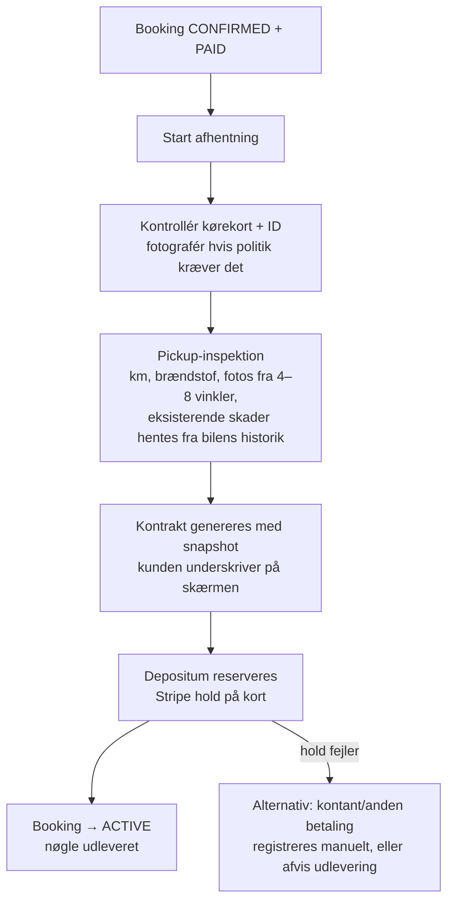
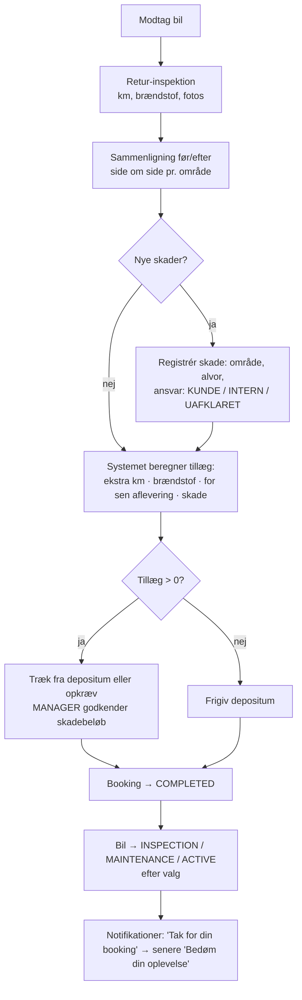

# F — Admin flows

Princip (§46): en medarbejder skal kunne klare de ni kerneopgaver fra dashboardet med højst 2 klik. Admin-UI er **mobilvenligt**, fordi inspektioner foregår på parkeringspladsen med en telefon.

## F0. Dashboard — "Hvad skal jeg gøre i dag?"

```
┌─────────────────────────────────────────────────────────────┐
│ [Lokation ▾]  [I dag ▾]                       🔍 Søg ref/navn/reg.nr │
├───────────┬───────────┬───────────┬───────────┬─────────────┤
│ Afhentes  │ Afleveres │ Aktive    │ Ledige nu │ På service  │
│ i dag: 6  │ i dag: 4  │ lejer: 11 │ biler: 9  │ 2           │
├───────────┴───────────┴───────────┴───────────┴─────────────┤
│ Kræver handling: 2 ubetalte · 1 fejlet besked · 3 nye henvendelser │
├─────────────────────────────────────────────────────────────┤
│ I DAG — tidslinje                                           │
│ 09:00 ↑ BK-7Q4F2  Anna J.  Corolla AB12345  [Paid] [Start afhentning] [WhatsApp] │
│ 11:30 ↓ BK-2M9XC  Omar K.  Tiguan CD67890   [Active] [Modtag bil] [Ring]          │
├─────────────────────────────────────────────────────────────┤
│ KPI (MANAGER+): omsætning · udestående · nye kunder        │
└─────────────────────────────────────────────────────────────┘
```

De ni kerneopgaver:

| # | Opgave | Hvor |
|---|---|---|
| 1 | Se dagens bookinger | Dashboard-tidslinje |
| 2 | Se ledige biler | Dashboard-kort "Ledige nu" → filtreret flådeliste |
| 3 | Åbne en booking | Klik på række / søgning / kalender |
| 4 | Kontakte kunden | Knapper på booking: Ring (`tel:`), WhatsApp (`wa.me`), E-mail |
| 5 | Se betaling | Booking → fane "Betaling" (betalinger, refunderinger, depositum) |
| 6 | Se kontrakt | Booking → "Kontrakt" (PDF, signeret ja/nej) |
| 7 | Se skader | Booking → "Inspektioner" (før/efter side om side) |
| 8 | Markere bil som afleveret | "Modtag bil" → retur-inspektion |
| 9 | Sende besked | Booking → "Send besked" (skabelon eller fri tekst; e-mail/WhatsApp) |

## F1. Afhentning (pickup)



## F2. Aflevering (return)



## F3. Telefon-/skrankebooking

```
/admin/bookings/new → søg/opret kunde → vælg datoer, sted, model → systemet viser ledige biler + quote
→ ekstraudstyr, rabat → vælg betaling: send betalingslink (Stripe) / betal ved skranke / faktura
→ samme booking-service som web (samme regler, samme constraint)
```
MVP (M10): kunden oprettes som gæst (knyttes til en konto ved login). Betalingslinket er gæstens administrér-link; reservationen holdes 24 timer. Faktura er PHASE 2. Levering vælges ikke i telefonbookingen endnu.

## F4. Bil går i stykker / bliver utilgængelig

```
/admin/fleet/cars/[id] → "Tag ud af drift" (vælg årsag + forventet periode)
→ Systemet viser alle fremtidige bookinger på bilen i perioden
→ For hver: [Omplacér til anden ledig bil af samme model] (auto-forslag)
            [Opgradér til anden model]  [Annullér + fuld refund]
→ Kunden får besked om ændringen
→ AuditLog registrerer handlingen
```
Systemet forhindrer, at en bil sættes i MAINTENANCE i en periode med aktive bookinger uden at håndtere dem først.
MVP (M11): bilsiden viser bilens kommende bookinger med link til hver. Status kan kun skiftes, når personalet har bekræftet listen; bookingerne beholder bilen, indtil de flyttes med "Skift bil", "Ændr periode" eller "Annullér" på bookingen. En udlejet bil kan ikke skifte status, og et værkstedsbesøg kan ikke lægges oven i en booking (databasen håndhæver det). Automatisk besked til alle berørte kunder og "Opgradér til anden model" i ét trin er PHASE 2.

## F5. Ændring af dato (efter kundens anmodning)

```
Booking → "Ændr" → nye datoer → availability-tjek på samme bil (ellers forslag om anden bil)
→ ny quote vises med difference → bekræft
→ differencen opkræves (betalingslink) eller refunderes
→ BookingStatusEvent + AuditLog + besked til kunden
```
MVP (M10): en merpris registreres som betaling ved skranken (manuel betaling), en mindrepris refunderes af en leder. Betalingslink til en difference er PHASE 2.

## F6. Annullering og refundering (MANAGER+)

```
Booking → "Annullér" → årsag → politik foreslår refusionsbeløb (kan overstyres af MANAGER med begrundelse)
→ Stripe refund → PAYMENT(kind=REFUND) → payment_status REFUNDED/PARTIALLY_REFUNDED
→ bil frigives → besked til kunden
```

## F7. Kalender

- Visninger: dag / uge / måned.
- Standardvisning: **tidslinje pr. bil** (rækker = biler, blokke = bookinger og service). Det er den mest nyttige visning for udlejning, fordi huller i flåden ses med det samme.
- Farver = bookingstatus (samme badges som overalt). Klik → åbner booking i sidepanel.
- Filtre: lokation, kategori, status.
- PHASE 2: træk-og-slip omplacering mellem biler.

## F8. Priser, ekstraudstyr, rabatter, lokationer (MANAGER+)

- **Priser:** tabel pr. kategori (rækker = varighedstrin 1/3/7/30 dage), med valgfri override pr. model og sæson (gyldig fra/til). Forhåndsvisning: "En kunde der booker 5 dage betaler X". Ændringer påvirker kun nye bookinger.
- **Ekstraudstyr:** opret/redigér/deaktivér (ikke slet, hvis brugt i bookinger), navn på alle sprog, pris pr. dag eller pr. booking, loft, lager.
- **Rabatter:** kode, procent/fast, periode, minimum, maks. brug, begrænsning til kategorier/modeller; viser antal brug.
- **Lokationer:** opret/redigér/deaktivér, åbningstider + særlige dage, leveringszoner med gebyr.

## F9. Beskeder og notifikationer

- `/admin/messages`: indbakke for kontaktformular (status: ny → i gang → besvaret). Svar sendes pr. e-mail fra systemet og logges.
- `/admin/notifications`: alle automatiske udsendelser med status; fejlede kan genforsøges med ét klik.

## F10. GDPR-anmodning

```
/admin/customers/[id] → "Eksportér data" (ZIP: JSON + dokumenter) eller "Anonymisér"
→ Anonymisering: navn/kontakt/kørekort/dokumenter fjernes; bookinger + betalinger bevares med pseudonym (bogføringsloven)
→ Blokeres hvis kunden har aktiv booking eller uafklaret skade
→ AuditLog
```

## F11. Brugere og roller (SUPER_ADMIN)

Invitér medarbejder via e-mail → vælg rolle → medarbejder sætter password + 2FA (påkrævet for MANAGER og SUPER_ADMIN). Deaktivering lukker alle sessions straks.
